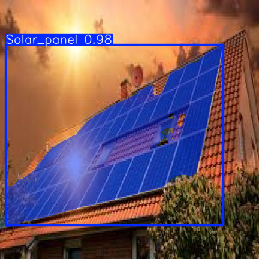
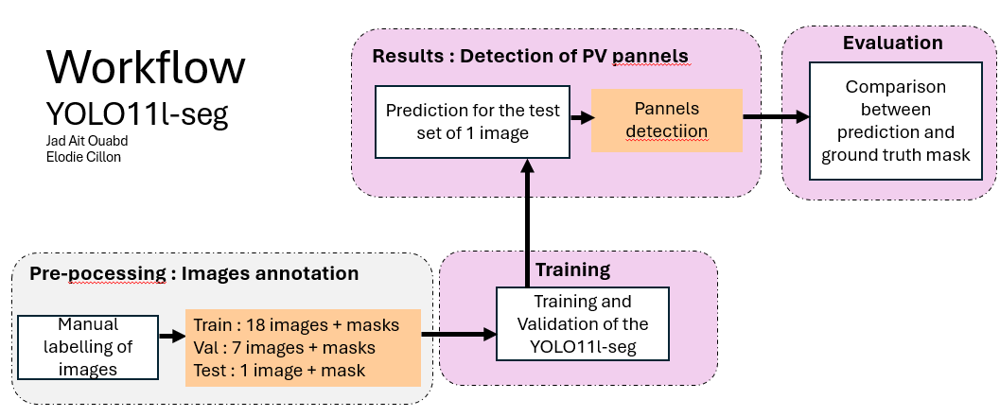

# OperationalResearch

This repository contains **two distinct projects** related to solar energy analysis and computer vision, developed using Python.

---

# Part 1 — Georeferenced Irradiance & Temperature Analysis  
**Lyon–Grenoble–Chambéry region — July 2018**

## Project overview

This project provides a reproducible Python workflow to **download**, **process**, and **visualize** georeferenced **solar irradiance** and **near-surface atmospheric moisture (2 m dewpoint temperature)** over a limited region in southeastern France (Lyon–Grenoble–Chambéry), for **July 2018**.

The objective is to analyze:
- the **temporal variability** of solar irradiance at regional scale,
- the **spatial distribution** of irradiance and atmospheric moisture using cartographic representations.

## Data sources (Copernicus Atmosphere Data Store — ADS)

The following datasets from the Copernicus Atmosphere Data Store (ADS) are used:

- **CAMS gridded solar radiation**
  - Global Horizontal Irradiance (GHI)
  - Direct Normal Irradiance (DNI / BNI)
  - Diffuse Horizontal Irradiance (DHI)
  - Beam Horizontal Irradiance (BHI)

- **CAMS Global Reanalysis (EAC4, monthly)**
  - 2 m dewpoint temperature (monthly mean)

## Scripts and workflow

### Irradiance (CAMS solar radiation)

- `extract_irrad.py` — downloads CAMS irradiance for the study area (ZIP output)
- `unzip.py` — extracts the downloaded ZIP archive
- `conversion_irrad.py` — converts NetCDF files into a merged CSV  
  → output: `lyon7_2018.csv`
- `times_series.py` — generates an **area-averaged irradiance time series**
- `cartographic_heatmap.py` — produces a **cartographic heatmap** (mean GHI) over an OSM basemap

### Temperature / atmospheric moisture (EAC4 monthly)

- `extract_temp.py` — downloads EAC4 monthly 2 m dewpoint temperature (GRIB)
- `convert_temp.py` — converts GRIB to CSV and performs Kelvin → °C conversion  
  → output: `dewpoint_lyon7_2018.csv`
- `map_temp.py` — produces a spatial heat map with **annotated mean values per grid cell**

> **Note**  
> The EAC4 monthly dataset may have a **coarse spatial resolution** over a small domain.  
> In such cases, only a limited number of grid cells are available; annotating values improves interpretation transparency.

## Study area

All data downloads use the same bounding box, defined as **[North, West, South, East]**:

North = 46.3
West  = 4.7
South = 45.4
East  = 6.1

--- 

# Part 2 —☀️ Photovoltaic Panel Detection using YOLOv8



## Overview

This project implements an automatic detection of photovoltaic (PV) panels in aerial or satellite images using a deep learning object detection model based on **YOLOv8**.

The workflow relies on a custom annotated dataset hosted on Roboflow and uses the **Ultralytics YOLOv8** framework for training and inference. The notebook is designed to be simple, reproducible, and suitable for academic use in solar energy, remote sensing, and urban-scale analysis.


---

## Objectives

- Detect photovoltaic panels in aerial or satellite imagery  
- Train a custom YOLOv8 object detection model  
- Perform inference on unseen images  
- Visualize and interpret detection results  

---

## Repository Structure
```text
dataset/
├── train/
│   ├── images/
│   └── labels/
├── valid/
│   ├── images/
│   └── labels/
├── test/
│   ├── images/
│   └── labels/
└── data.yaml
```

> The `data/` and `runs/` folders are created automatically when running the notebook.

---

## Requirements

### Python
- Python **3.9 or higher** is recommended

### Libraries Used

The following Python libraries are used in the notebook:

- `ultralytics`
- `roboflow`
- `torch`
- `torchvision`
- `matplotlib`
- `Pillow`
- `pathlib`
- `zipfile`
- `os`

### Installation

It is recommended to use a virtual environment.

```bash
pip install ultralytics roboflow matplotlib pillow
